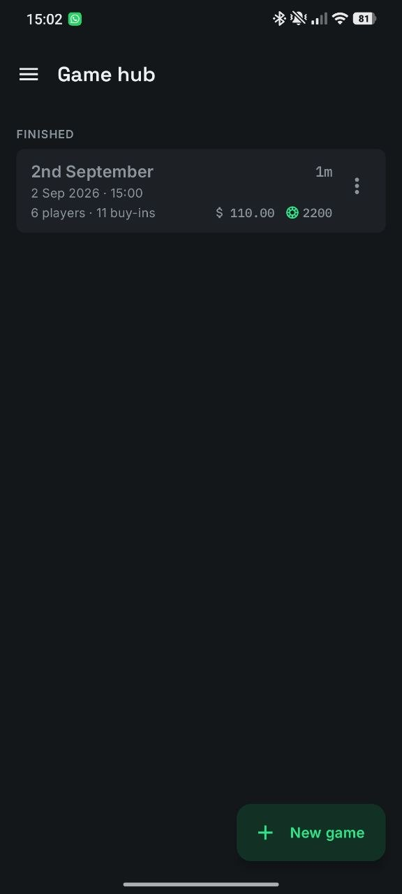
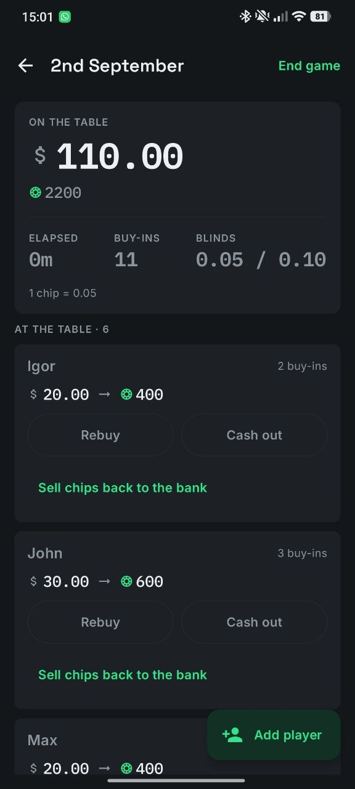
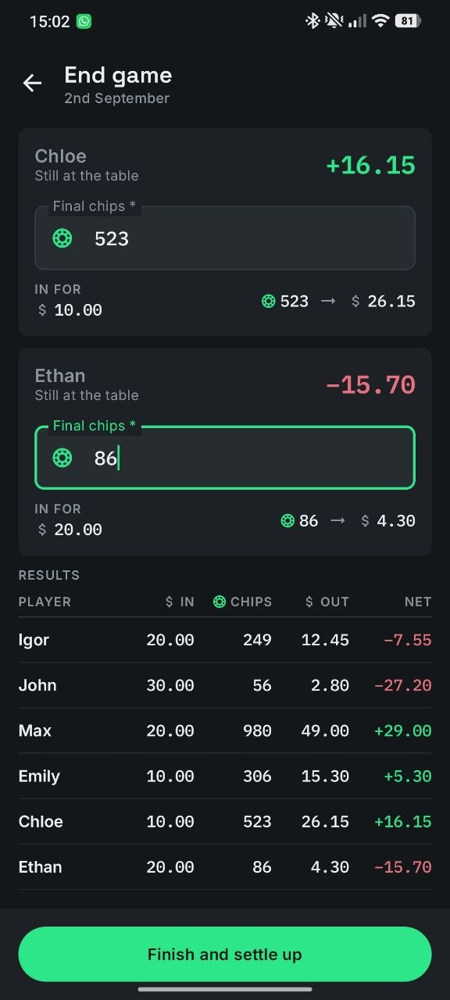
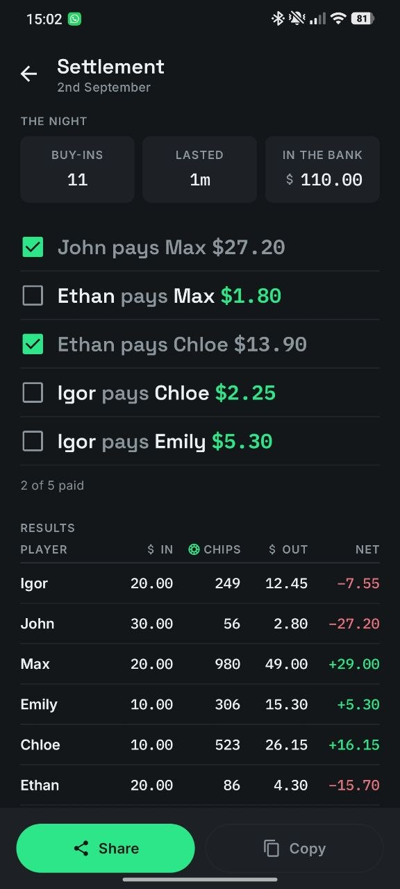
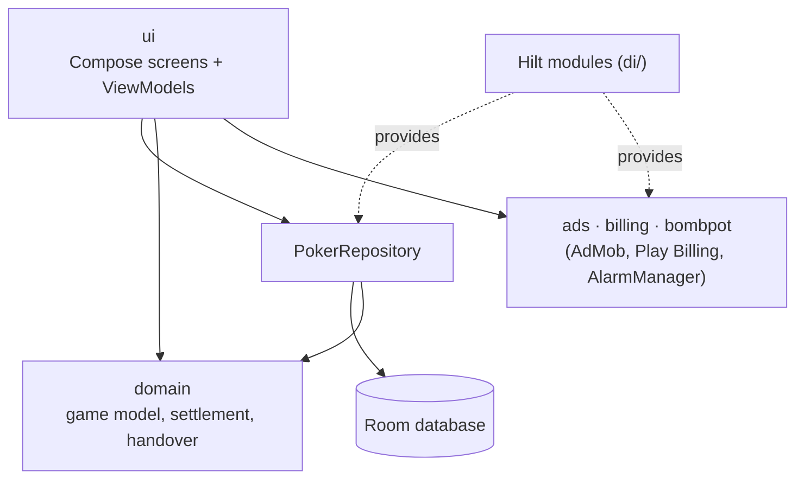

<p align="center">
  
</p>

<h1 align="center">Poker Tracker</h1>

<p align="center">
  An Android app that works as the bank for a home cash game: buy-ins, rebuys and cash-outs during the night, then who pays whom at the end.
</p>

<p align="center">
  
  
  
</p>

<!-- TODO: uncomment once the app is live on Google Play, and check that the link opens its page.
<p align="center">
  <a href="https://play.google.com/store/apps/details?id=com.zango.pokertracker">
    
  </a>
</p>
-->

## About

Poker Tracker keeps the books for a home poker cash game. The host records every buy-in, rebuy, chip sale and cash-out as the night goes on. At the end the app checks the chip counts against the money that came in, then works out the payments that settle everyone up. It started as a tool for my own games and is being prepared for release on Google Play.

All game data stays on the phone. There is no account and no server. Games move between phones only when a host hands one over by QR code or file.

## Screenshots
<table>
  <tr>
    <td></td>
    <td></td>
    <td></td>
    <td></td>
  </tr>
</table>

## Features

- **Game setup.** Set the blinds by hand or pick from a list of common stakes. Chip value can be worked out from the chip markings. The buy-in can be set in big blinds or cash, with per-player overrides and an optional random seating order.
- **Live game.** Record rebuys, cash-outs and chips sold back to the bank, with undo. Players can join mid-game, and seats can be swapped on a table view. The screen also shows elapsed time and total buy-ins.
- **End of game check.** Enter the final chip counts. The app shows whether every chip is accounted for, or how many are missing or extra.
- **Settlement.** A short list of "A pays B" payments, rounded to the smallest note or coin you use. Any rounding difference is shown. Share or copy the list, and mark each payment as paid.
- **Side games.** A bomb pot timer that sends a notification and vibrates even when the app is closed. There is also a firetruck tracker (three pots in a row).
- **Game handover.** Pass a running game to another host's phone with a QR code, or as a file when the game is too big for one code.
- **Player roster and stats.** Profit over all games, games played and buy-ins for each player, with sorting and filters. Players can be renamed or hidden without changing past results.
- **Localization.** English, Russian, Spanish, German and French, with an in-app language switch and a choice of currency symbol.
- **Ads with a way out.** Banner and interstitial ads, with consent handled through Google's User Messaging Platform. A one-time in-app purchase removes them.

## Tech Stack

- **Language:** Kotlin 2.0.21, JVM target 17
- **UI:** Jetpack Compose, Material 3, Navigation Compose, single activity
- **Architecture:** MVVM (ViewModel + `StateFlow` UI state), layered into `ui` / `domain` / `data`
- **DI:** Hilt 2.52 (KSP)
- **Storage:** Room 2.6.1 (schemas exported to `app/schemas/`), SharedPreferences for small UI state
- **Async:** Kotlin Coroutines and Flow
- **Game handover:** kotlinx.serialization, ZXing (QR generation), Google Code Scanner (QR scanning)
- **Monetization:** Google Mobile Ads (AdMob), User Messaging Platform, Play Billing 9
- **Testing:** JUnit 4, kotlinx-coroutines-test, Turbine

<details>
<summary>Build configuration</summary>

| Setting | Value |
| --- | --- |
| `applicationId` | `com.zango.pokertracker` (debug builds add `.debug`) |
| `versionName` | 1.2.1 |
| `minSdk` / `targetSdk` / `compileSdk` | 26 / 36 / 36 |
| Android Gradle Plugin | 8.13.2 |
| Gradle | 8.13 (wrapper) |
| Compose BOM | 2025.09.01 |

All dependency versions are listed in [`gradle/libs.versions.toml`](gradle/libs.versions.toml).

</details>

## Architecture

The app is a single Gradle module with three layers. `ui` holds one package per screen, each with a Compose screen, a ViewModel and a UI state class. `domain` holds plain Kotlin: the game model, chip and money arithmetic, reconciliation, settlement and the handover format. `data` puts Room DAOs behind a `PokerRepository` interface. Money and chips have their own value types (`core/money`) instead of floating-point numbers, so settlement results are exact.



## Building from Source

### Requirements

- Android Studio 2026.2.1 Canary 5 (the version the project is developed in)
- JDK 17 or newer to run Gradle. The Gradle daemon asks for JetBrains JDK 21 and downloads it automatically if it is missing.
- Android SDK Platform 36

### 1. Clone

```bash
git clone https://github.com/Zangormo/homepoker_tracker.git
cd homepoker_tracker
```

### 2. Create `local.properties`

Copy the template:

```bash
cp local.properties.example local.properties
```

Then edit it:

- `sdk.dir`: path to your Android SDK. Android Studio fills this in on its own.
- `RELEASE_STORE_FILE`: **required, even for debug builds.** The release build type looks up its signing config during Gradle configuration. If this key is missing, every task fails with `SigningConfig with name 'release' not found`. For a debug build, any path works and the file does not have to exist.
- `RELEASE_STORE_PASSWORD`, `RELEASE_KEY_ALIAS`, `RELEASE_KEY_PASSWORD`: only needed to sign a release build with your own keystore.
- `ADMOB_*`: the real AdMob IDs, used only by the release build. A debug build ignores them and always uses Google's public test ad IDs, so it never shows real ads. A release build fails if any of them is missing.

Each of these keys can also be passed as an environment variable with the same name. Never commit `local.properties` or a keystore. Both are git-ignored.

No `google-services.json` is needed. The app does not use Firebase.

### 3. Build and install a debug APK

```bash
./gradlew assembleDebug
```

The APK is written to `app/build/outputs/apk/debug/`. The debug build uses the package name `com.zango.pokertracker.debug`, so it installs next to the Play Store version instead of replacing it.

### Tests and release checks

```bash
./gradlew testDebugUnitTest
```

Unit tests live in `app/src/test/`. They cover money and chip arithmetic, settlement, Room migrations, the handover format and the ViewModels.

```bash
./gradlew verifyRelease
```

`verifyRelease` runs the release unit tests and lint (lint treats warnings as errors), then builds the minified, signed release bundle. It needs a real keystore.

## Permissions

| Permission | Why |
| --- | --- |
| `INTERNET`, `ACCESS_NETWORK_STATE` | Loading ads. Game data never leaves the device. |
| `AD_ID` and `ACCESS_ADSERVICES_*` | Added by the Google Mobile Ads SDK for ad delivery and measurement. Personalization follows the consent you choose in Settings > Privacy options. |
| `com.android.vending.BILLING` | The one-time "Remove ads" purchase. |
| `POST_NOTIFICATIONS` | The bomb pot notification when the app is closed. |
| `SCHEDULE_EXACT_ALARM` | Makes the bomb pot alert arrive on time. The timer still works without it, just less precisely. |
| `RECEIVE_BOOT_COMPLETED` | Sets the bomb pot alarms again after the phone restarts. |
| `VIBRATE` | Vibrates when a bomb pot is due. |
| `WAKE_LOCK`, `FOREGROUND_SERVICE` | Added by Google Play services libraries. |

The app does not ask for camera access. QR scanning uses Google's Code Scanner, which runs outside the app. App data is excluded from cloud backup and from device-to-device transfer.

Privacy policy: <https://zangormo.github.io/poker_cashier_privacy_page/>

## License

This project has no open-source license. The code is published for reference only, and all rights are reserved.

## Author

<!-- TODO: add your name and contact details (GitHub profile, email or website). -->
Ilja Birjukov
